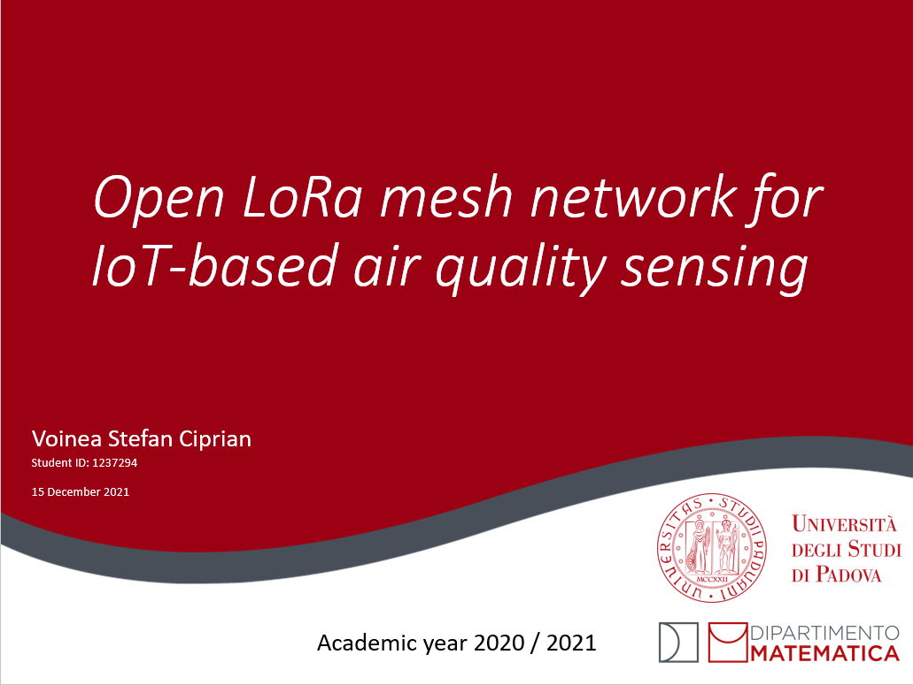
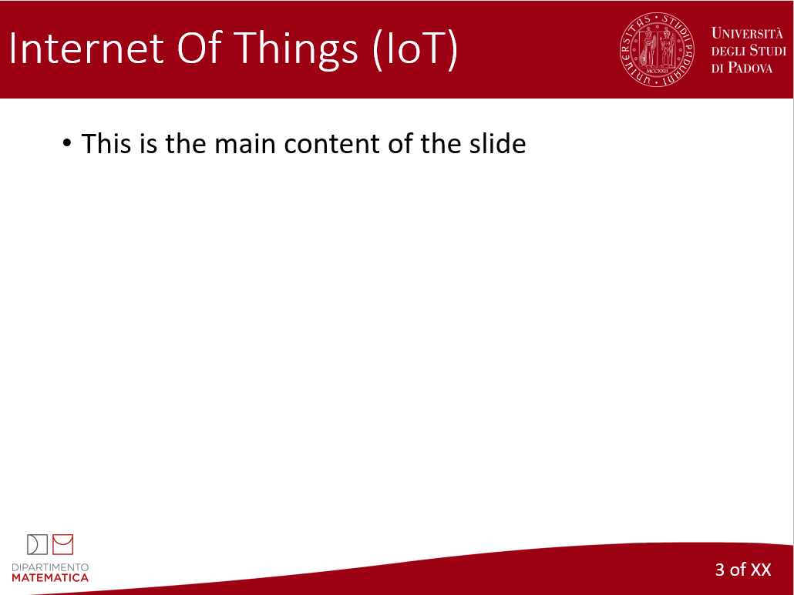

# Template for PowerPoint slides used in UniPD, Department of Mathematics and Computer Science presentations.

This repository contains a `*.potx` file that is a template for slides used in presentations at the Università degli Studi di Padova.
Particularly, the logos used are the ones for the Department of Mathematics and Computer Science.

[Direct link to dowload the file.](https://github.com/cipz/unipd_slide_tempate/blob/main/TEMPLATE%20UNIPD.potx?raw=true)

<table>
  <tr>
    <td>Title Slide</td>
    <td>Content Slide</td>
  </tr>
  <tr>
    <td></td>
    <td></td>
  </tr>
 </table>
